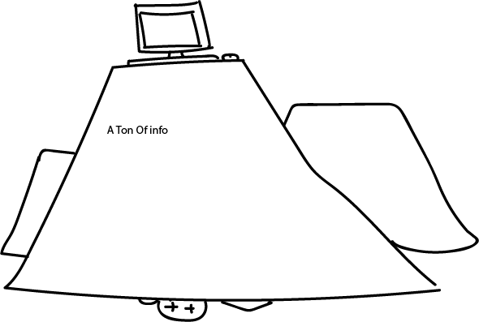

# repo
<html>
<head>
   <meta charset="utf-8">
   <link rel="stylesheet" href="css/main.css">
   <title>Dao of web Design / Summary</title>
   <meta name="author" content="Victoria Lopez">
</head>

<body>
<h1>Summary of A Dao of Web Design</h1>

<a href="https://alistapart.com/article/dao">Read the <strong>Full Article</a></strong>

By <a class="fragment" href="#victoria-lopez">Victoria Lopez</a>

<time datetime="2017-09-10">September 14th, 2017</time>
 
In the article <em>by John Allsopp</em> <b>A Dao of Web Design</b> he kind of breaks it up for you in sections kind of like a game plan but for web design. He doesn't get to tecnical but more conseptual. He puts it to you straight and encourages the reader to worry abot content over astetic. there is no point to making somthing look good if there is no stuffing."personality matters too not just looks"

John's first section has a beginning phrasing  <q>Evolution rather than Revolution
That gives the back story to the evolution of the web that is also mentioned in <i>(HTML5 for Web Designers)</i> and it go's over a breef history of technology but using the t.v. and radio as the example electronics. he makes the comment on the transition between the creation of basicaly the second generation or 2.0 of the radio which was the t.v. when it first came out people refered to it as the radio with pictures. that is a very real situation of evolution in technology were the radio has now become the parent and the T.V is the child and the relation that happens in corespondince with that. and the statment that the tv was not revolution ary because there was a predecessor befor the tv that had a cowpat that nedded to be toped off with cement/pavment. and the importance to not forget what came before but to build on it.

The second section is telling you that you need to crawl before you can run. and that, thats ok because its beter to start from the beginning it also talks about the the possibilitys and choices that are available to Web Designers once they have a hang of it. these choices and way of making sylesheets and using markup realy makes a difference in creating the syle and fonts that you want and being able to present you ideas efficently so someone or somthing else can understand them.

The ability to be adaptable and accessibile just like over coming challenges in life you need to adapt to those changes and the same goes for the web you need to make sure that all other vesions of html or your code or watever need to be compatible with each other so it functions properly.and adapts to any up and comming changes. and last ly think about how you want to put information on the page based on importance or relevance through functionality. some examples are like making the title bold or choosing a specific way to list the information in order of how it should be presented and inclusion of links and so fort. another step to showing there importance or relevance is adding color maybe as a highlight or to surround a text box of important information. but remember content always first.

In concuusion there is a prosses that you should go through to keep your work organized and readable but more importantly you need to know how you want to format your work band what is the content of the work before you get to the astetic propertys of a web page.ending off with the phrase mind over matter.

<h2> <id="victoria-lopez"><a href"fragment">About the Author</a href></h2>

Victoria Lopez is a senior at Montserrat college of art compleating her BFA. She is currently living in Massachussets with the best roomies ever. She will graduate this December, and is more than excited for her senior show. p.s shes realy bad with computer stuffs.

</body>
</html>

